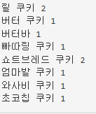

청주대학교 자바 과정중에 학교에서 내어준 과제입니다.
한번 해봤더니 재밌어서 다같이 공유했으면 좋겠습니다!

먼저 코드 내용을 보여드리겠습니다


입력 예시


출력 예시


```java
import java.io.PrintStream;
import java.util.*;

public class Main {
    public static void main(String[] args) throws Exception {
        Scanner scanner = new Scanner(System.in, "UTF-8");
        PrintStream print = new PrintStream(System.out, true, "UTF-8");
        ArrayList<String> senlist = new ArrayList<>();
        while(scanner.hasNext())senlist.add(scanner.nextLine());
        scanner.close();
        Set<String> tset = new TreeSet<>(senlist);
        for(String str: tset)print.println(str+ " " + Collections.frequency(senlist,str));
    }
}
```
여기서 먼저 저는 입력을 얼마나 받을지 모르기 때문에 ArrayList를 import 하여서 기본값으로 생성해주었습니다.

그 이후 Scanner 의 메소드인 hasNext()를 이용하여 입력의 끝을 받고 그것을 모두 ArrayList 에 저장하여 그것을 Set의 종류중
TreeSet 에 넣었습니다.

TreeSet에 넣으면 오름차순으로 정렬 돼고 Collections 의 메소드인 frequency 를 이용하면 동일한 것이 몇번 들어왔는지 확인이 가능하여
그 점을 이용하여 동일한것이 몇번 나왔는지 확인이 가능했습니다.

이를 이용해 출력을 해주면 출력 예시와 같이 출력이 됩니다.


TreeSet 이란? 자바의 SortedSet 인터페이스 중 하나이다.

Hashset과 비슷한 구조를 가지고 있고 중복 데이터를 저장하지 않고 순서를 유지하지 않는다는 성질을 가지고 있다. HashSet과의 차이점은 이진탐색트리 구조를 가지고 있다.

레드-블랙 트리로 구현되어있다.


